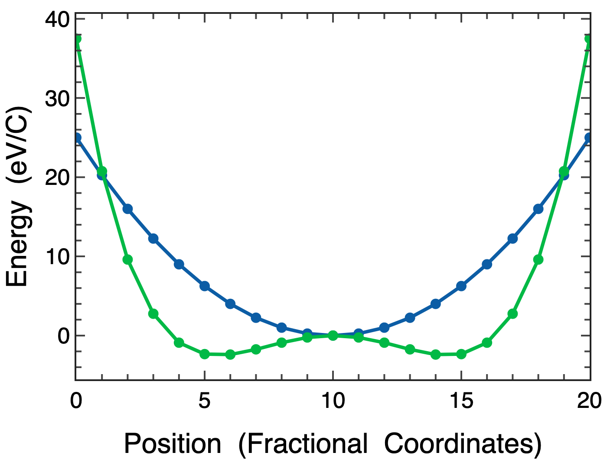
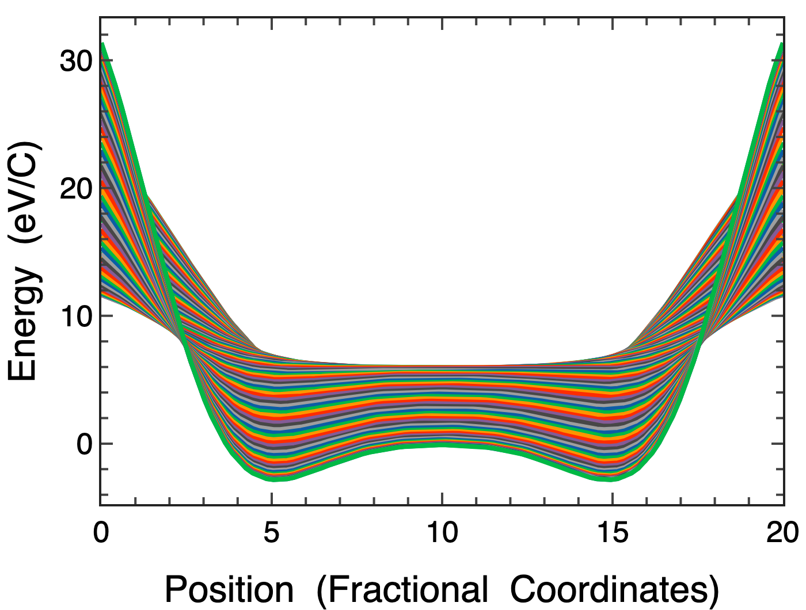
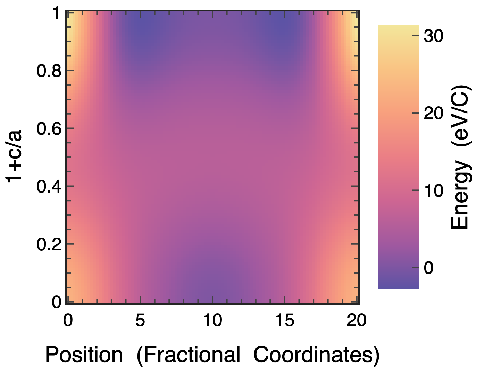
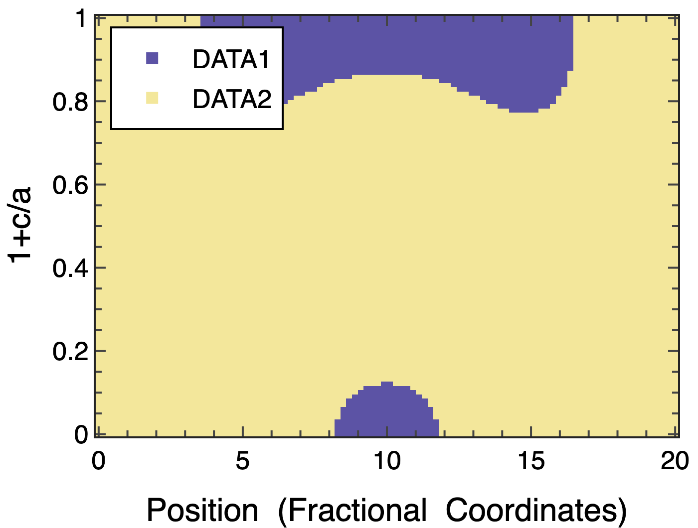

# Simple command line tools to make decent looking plots

I often find that i want to do something like:

```
cat <output_of_some_process> | grep 'some matching pattern' | awk '{print $1, $2}'  > data
```

And I want to quickly make a plot of the columned data. I could probably use 

```
cat data | gracebat -hdevice PNG -hardcopy -printfile out.png -pipe -nxy - -fixed 3840 2160
```

But I find xmgrace to be a bit clunky when it comes to doing anything fancy such as adding labels etc.

This python library attempts to make a version of this which 
- Reads data from stdin
- Uses Plotly
- Looks good by default
- Can do some basic interpolation
- Can plot 1D and 2D data
- Can call custom templates [WIP]

## Basic usage:
```
> cat data
####Energy  (eV/C)
###1+c/a 
##Position  (Fractional  Coordinates)
#DATA1           0            1
0           25.0         37.5
1           20.25        20.75625
2           16.0         9.600000000000001
...
```

```
cat data | pl-line'
```



### Overwrite axis labels
```
cat data | pl-line -x 'Nice xlabel [ABO<sub>3</sub>]' -v 'Another Nice label' 
```


### Interpolate data (along both axes) and plot lines
```
cat data | pl-line -R 100 -m 'lines'
```



### Interpolate data (along both axes) and plot surface
```
cat data | pl-surf -R 100 --colorbar
```



### Read two gridded fields, interpolate them and plot the lowest 
```
cat data | pl-surf -R 100 --colorbar
```


