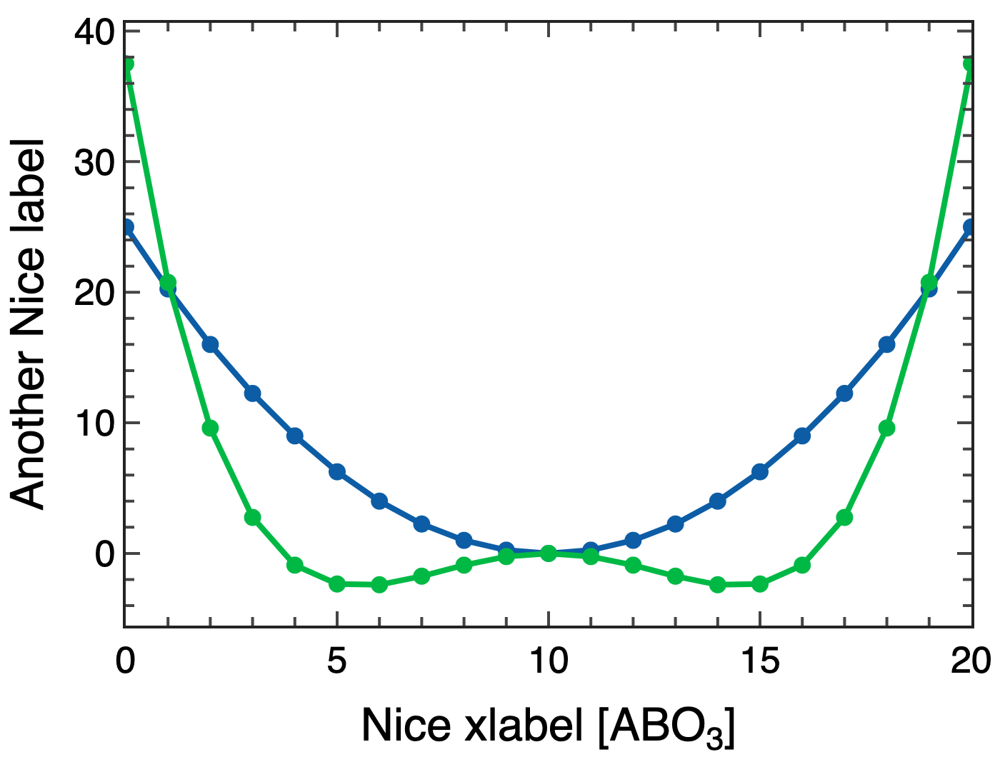

# Simple command line tools to make decent looking plots

I often find that i want to do something like:

```
cat <output_of_some_process> | grep 'some matching pattern' | awk '{print $1, $2}'  > data
```

And I want to quickly make a plot of the columned data. I could probably use 

```
cat data | gracebat -hdevice PNG -hardcopy -printfile out.png -pipe -nxy - -fixed 3840 2160
```

But I find xmgrace to be a bit clunky when it comes to doing anything fancy such as adding labels etc.

This python library attempts to make a version of this which 
- Reads data from stdin
- Uses Plotly
- Looks good by default
- Can do some basic interpolation
- Can plot 1D and 2D data
- Can call custom templates [WIP]

Basic usage:
```
cat data | pl-line -x x-data -v value
```



```
cat data | pl-line -R 100 
```


